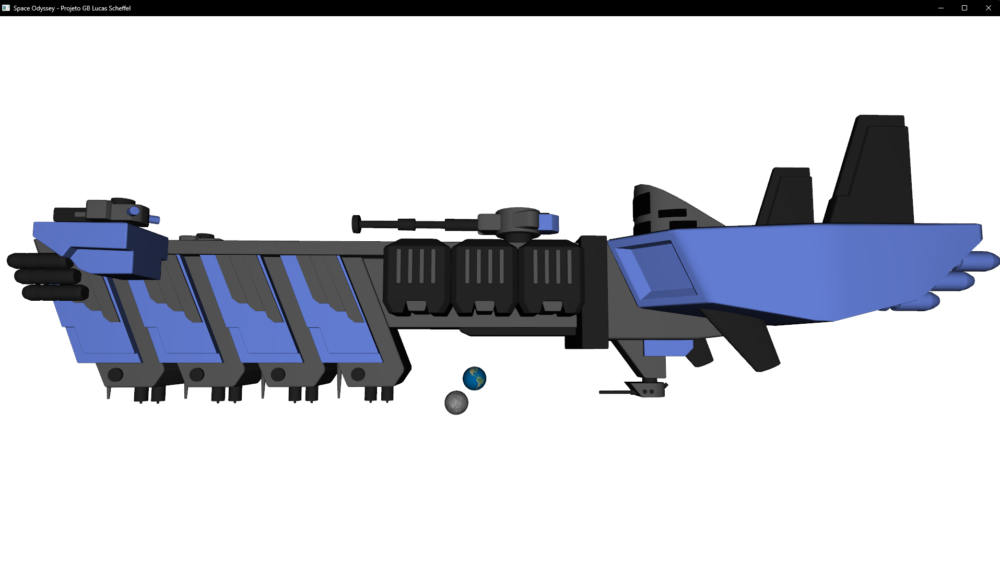

# Projeto Grau B - Lucas Scheffel:

## Space Odyssey:

-> Renderização de 3 objetos: Dois Planetas e um Light Cruiser (Modelos dos objetos disponibilizados pela Unisinos).

-> Texturas Aplicadas: Terra, Mercúrio e T_Spase_Blue (Texturas disponibilizadas pela Unisinos).

-> Movimentação de camera pelo ambiente, posicionamento de luz, controle de FOV, controle de rotação dos objetos nos eixos X, Y e Z.

-> Link para apresentação: [Apresentação (REQUER CONTA UNISINOS PARA ACESSO)](https://asavbrm-my.sharepoint.com/:v:/g/personal/lscheffel_edu_unisinos_br/ETvy2O_WBLlClLFMWUsNkU0Bffy1cZCaHh3UM-tfhS1IAw?nav=eyJyZWZlcnJhbEluZm8iOnsicmVmZXJyYWxBcHAiOiJTdHJlYW1XZWJBcHAiLCJyZWZlcnJhbFZpZXciOiJTaGFyZURpYWxvZy1MaW5rIiwicmVmZXJyYWxBcHBQbGF0Zm9ybSI6IldlYiIsInJlZmVycmFsTW9kZSI6InZpZXcifX0%3D&e=LTwJn8)

# Referências Utilizadas Para Desenvolvimento do Projeto:

<ul>
  <li>
    <h5>GLFW</h5>
    https://www.glfw.org/docs
  </li>
  <li>
    <h5>OpenGL/GLM Lib</h5>
    https://www.opengl.org/sdk/libs/GLM/
  </li>
  <li>
    <h5>Learn OpenGL</h5>
    https://learnopengl.com/
  </li>
  <li>
    <h5>OpenGL Tutorial </h5>
    http://www.opengl-tutorial.org/
  </li>
</ul>

# Ambiente de Desenvolvimento e Detalhes de Execução:

O jogo foi desenvolvido em plataforma Windows, utilizando o VSCode como IDE em conjunto com as extensões C/C++ e IntelliSense, compilando e executando através do prompt do Visual Studio Build x86 (Win32)

1. Seguir essa documentação para setup do ambiente: https://code.visualstudio.com/docs/cpp/config-msvc
2. Executar o prompt x86 do Visual Studio Build
3. Mude o diretório atual no prompt para o diretório root do repositório
4. Inicialize a IDE do VSCode: code .
5. Na IDE, navegue até a pasta Projeto GB e abra o arquivo main.cpp e execute-o com a extensão C/C++ da Microsoft para o VSCode.

Atenção: Passos Extras que podem ser necessários de acordo com seu ambiente:

-> No arquivo .vscode > c_cpp_properties.json, verifique se o argumento "compilerPath" está correto e existe em seu ambiente.